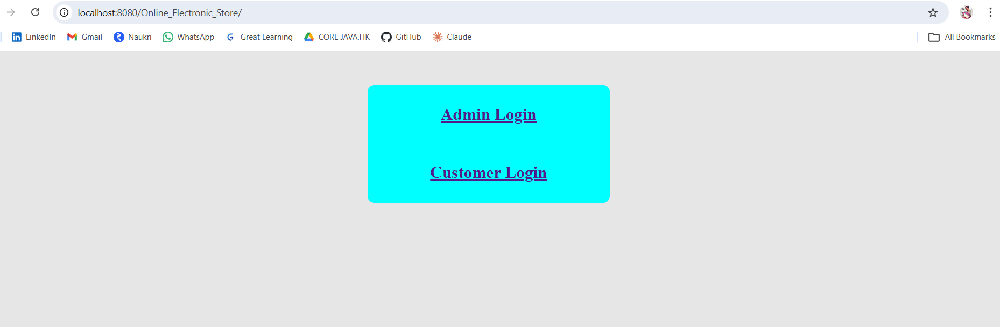
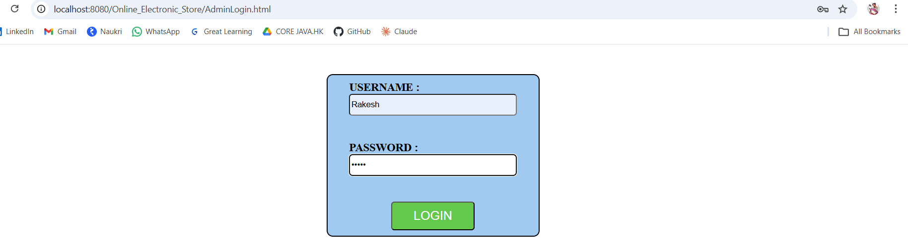
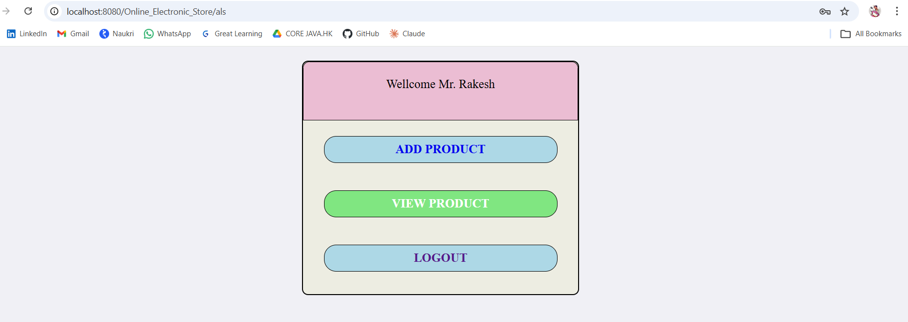
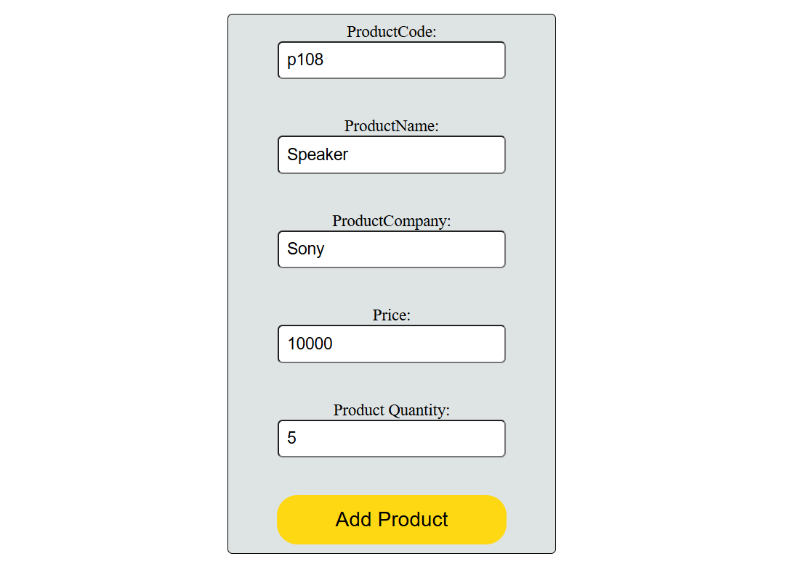
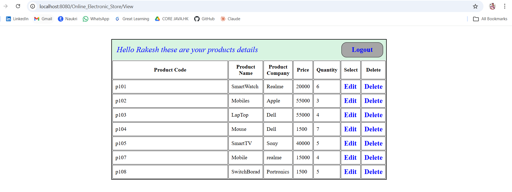
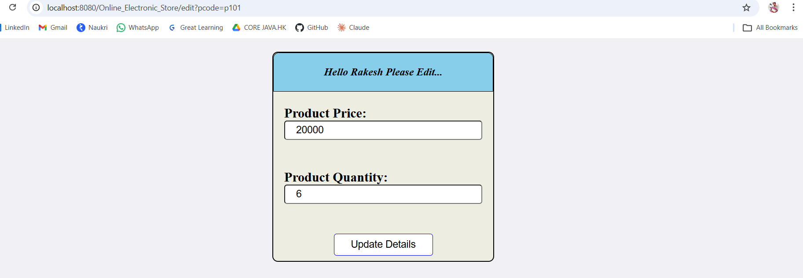
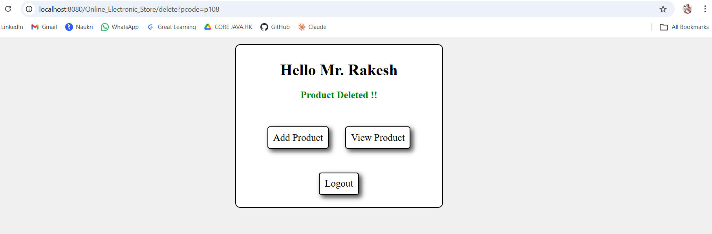
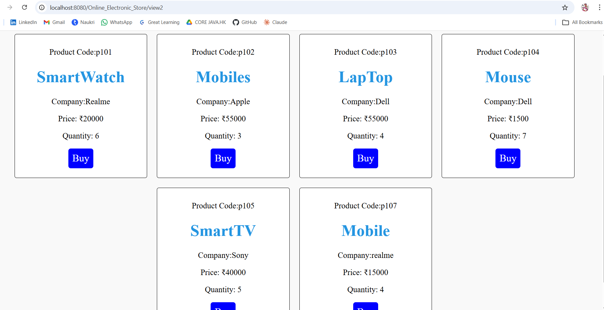
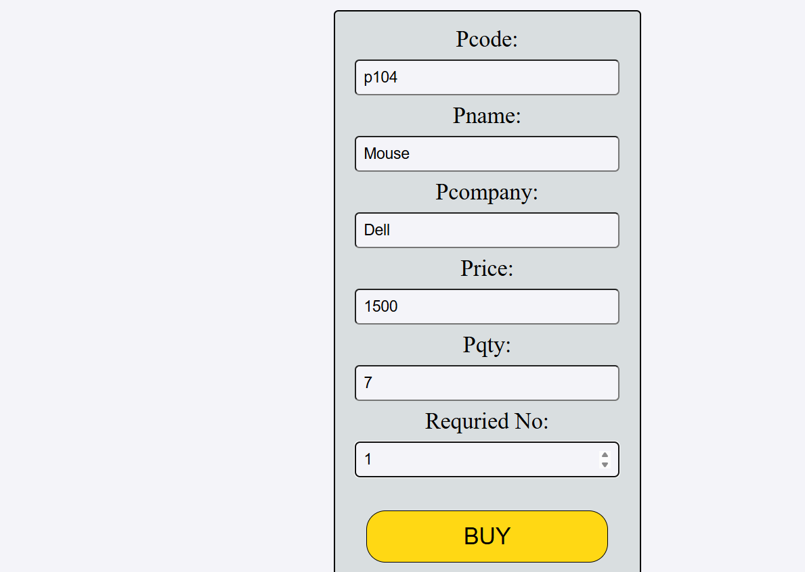

# 🛒 E-Commerce Electronic Store


---

## 📌 Overview

The **E-Commerce Electronic Store** is a Java-based full-stack web application that manages electronic products with **Admin** and **Customer** modules. Developed using Java Servlets, JSP, JDBC, and Oracle Database following **MVC architecture** with **DAO pattern** for database operations.

This project demonstrates real-world application design with secure login, session handling, complete CRUD operations, and a clean UI.

---

## 🛠️ Tech Stack

| Technology | Usage |
|---|---|
| Java SE | Core programming language |
| JDBC | Database connectivity |
| Oracle SQL & PL/SQL | Database and business logic |
| Servlets | Backend request handling |
| JSP | Dynamic frontend views |
| HTML & CSS | UI design |
| Apache Tomcat | Application server |
| Eclipse IDE | Development environment |

---

## 👤 Roles & Features

### 🔐 Admin Module
- Secure admin login with session management
- Add new products — name, price, company, stock quantity
- Edit and update existing product details
- Delete products from the catalog
- Full CRUD control over entire product inventory

### 🛍️ Customer Module
- Customer registration and secure login
- Browse complete product catalog posted by admin
- Select product and desired quantity
- Complete purchase end to end
- On-screen order confirmation with product name, quantity and delivery status

---

## 📸 Screenshots

### 🔐 Login Page


---

### 🔐 Admin Login


---

### 🖥️ Admin Dashboard


---

### ➕ Add Product


---

### 📦 Products


---

### ✏️ Edit Product


---

### 🗑️ Delete Product


---

### 🔐 Customer Login


---

### 👀 View Products


---

### 🛒 Buy Product


---

### ✅ Order Confirmation


---

## 🗄️ Database

- Oracle SQL used for all data storage
- PL/SQL procedures for business logic
- JDBC for complete database connectivity
- Full CRUD operations implemented

---

## 🚀 How to Run

1. Clone the repository
```
git clone https://github.com/RakeshBorugala/ecommerce-electronic-store.git
```
2. Open project in **Eclipse IDE**
3. Configure Oracle DB credentials in `DBConnection.java`
4. Add project to **Apache Tomcat** server
5. Start server and open browser
```
http://localhost:8080/Online_Electronic_Store
```

---

## 💡 Key Learnings

- Implemented MVC architecture from scratch
- Hands-on experience with JDBC and Oracle SQL
- Built secure session based login for multiple roles
- Designed and executed complete CRUD operations
- Developed real world e-commerce flow end to end

---

## 👨‍💻 Developer

**Boragala Rakesh**
[](https://linkedin.com/in/rakesh-borugala)
[](https://github.com/RakeshBorugala)
